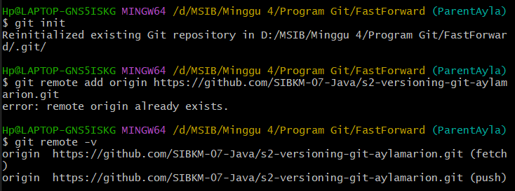
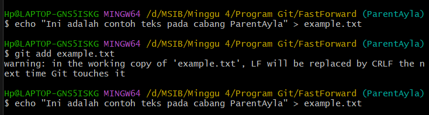
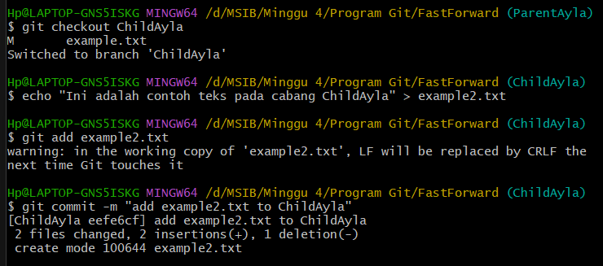
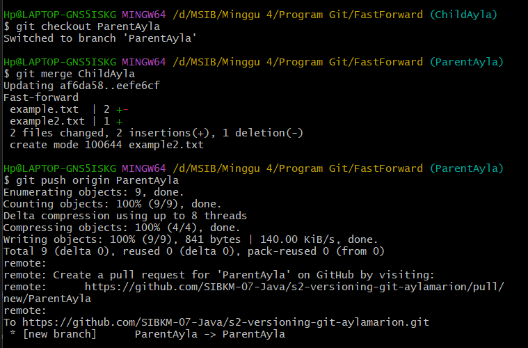
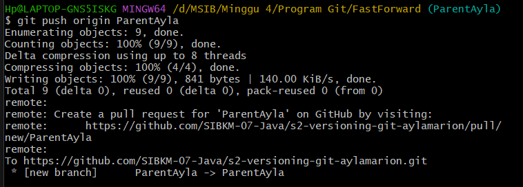
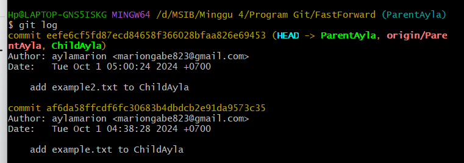

#  **Laporan Tugas Fast Forward**
## Ayla Marion

Menginisialisasi repo git di laptop

Membuat Branch Parent(ParentAyla) yang berisi file example.txt

Kemudian membuat branch child(ChildAyla) yang berisi file example2.txt

Melakukan Merge Fast FOrward antara ParentAyla & ChildAyla

Kemudian Mengirimkan commit yang baru ke dalam repository

Menampilkan dari history/commit yang sudah dilakukan
